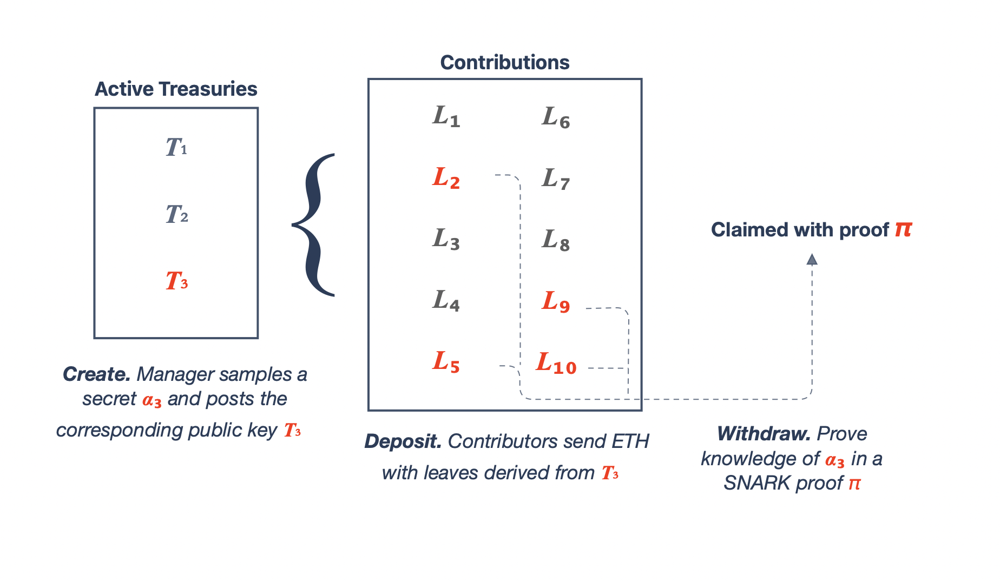
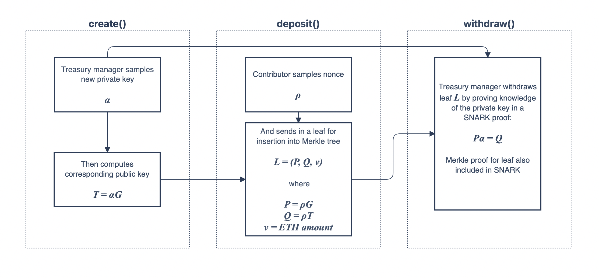

# Private Treasury

## Overview
Platform for DAOs with private treasuries. Based on [work done by Griffin Dunaif & Dan Boneh](https://hackmd.io/nCASdhqVQNWwMhpTmKpnKQ).

## Rest of Roadmap
0. Switch to C++ witness generation for SNARK. Much faster. 
1. ~~Deposit merkle tree. Managers create inclusion proofs by querying indexers 
   for emitted deposit events. Maintain list of hashes of spent leaves.~~
2. ~~Batch withdrawals. SNARK now covers batch merkle proofs and batch jubjub
   proofs.~~
3. Spec out using MetaMask Snaps for jubjub keygen, private key storage, and 
   proof generation. 
4. Barebones UI. 
5. Integrate Snaps. 
6. Fork JuiceBox & add private treasuries feature. 
7. [optional] Store spent leaves in a Merkle tree. Managers need to submit 
              Merkle exclusion proofs. 
8. [optional] Write a ledger VM to support proof generation. 

### To revisit: C++ witness generation
- snarkjs doesn't support yet since circom_runtime only works with wasm 
- plan to execute cpp executable directly via node's exec(), then use 
  groth16prove() instead of groth16FullProve()
- running into issues at the linking step with `make` for verif-manager_cpp, 
  might be an issue with gmp on my machine installed as 64 bit while fr_asm.o 
  uses 32 bit 

### Plan for 12/13/22 demo
- Showcase Merkle tree & batch withdraw implementations. 
- Barebones display with two tables, a text field, treasury_balance, 
  total_balance. First table has cols: treasury_pubkey, manager_pubkey, 
  manager_balance. Second has cols: leaf_P, leaf_Q, v_eth, is_unspent, is_owned. 
  is_owned and balance check will remain question marks until user inputs 
  manager private key into the text field. 
- Treasury table will have pre-seeded values.
- deposit_demo.ts populates the leaf table with 5 deposits per treasury. 
  Demonstrate is_owned and balance check after this happens. 
- With withdraw_demo.ts, show 1) manager_balance, is_owned, balance check 
  changes, 2) Merkle inclusion proofs for each of the leaves, 3) SNARK proof, 
  and 4) creation of the change leaf. Calling this twice has the same effect,
  spending the other leaves that are left. 
- Note: discuss applications of balance hiding 
